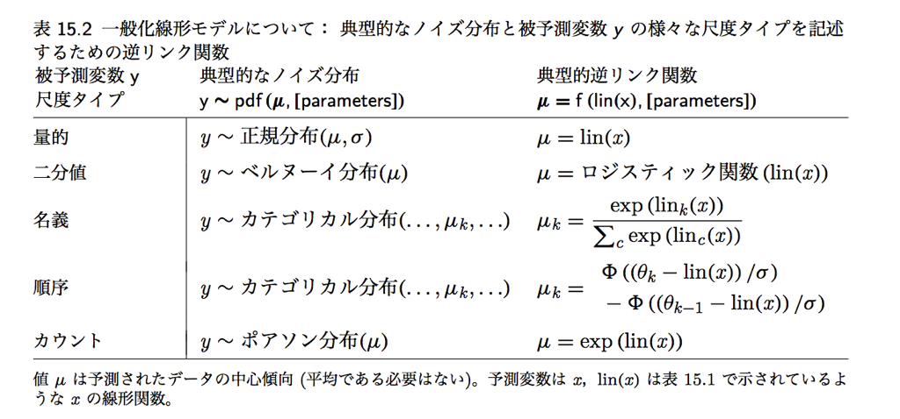

```{r libraries,echo=F,include=F}
# データ整形汎用パッケージ
library(tidyverse)
# MCMC乱数発生器stanをRからつかうパッケージ
library(rstan)
# rstanを並列で使うオプション
options(mc.cores = parallel::detectCores())
# 変更なしの実行ファイルは保存しておくオプション
rstan_options(auto_write = TRUE)
# データ要約・可視化パッケージ
library(summarytools)
# 複数のグラフを並べて表示するパッケージ
library(gridExtra)
library(GGally)
# ベイズモデル比較指標計算パッケージ
library(loo)
# ベイズモデルの結果を可視化するパッケージ
library(bayesplot)
# 描画の際に文字化けするMacユーザは次の行のコメントアウトをとって実行する
old = theme_set(theme_gray(base_family = "HiraKakuProN-W3"))
```

## Stanで回帰分析を実行する

#### データを作って
```{r}
# データの読み込み
bs <- read_csv("baseball.csv")
# 身長と体重のデータだけ読み込む
df <- bs %>% dplyr::select("weight", "height") %>% na.omit
```

#### いわゆる普通の回帰分析
```{r}
# 最尤推定
summary(lm(height ~ weight, data = df))
```

#### ベイジアン回帰分析
```{r}
# データはリスト型で渡す
dataset <- list(L = NROW(df), X = df$weight, Y = df$height)
```
```{r,results='hide'}
model.reg <- stan_model("regression.stan")
```
```{r, echo=FALSE, eval=TRUE}
paste(readLines("regression.stan"), collapse = "\n") %>% cat()
```

```{r}
fit.reg <- sampling(model.reg, dataset)
```
```{r}
# 係数の出力
print(fit.reg, pars = c("beta_0", "beta_1", "sigma"))
# プロット
plot(fit.reg,pars=c("sigma"),show_density=T)
bayesplot::mcmc_dens(as.array(fit.reg), pars = c("beta_0", "beta_1", "sigma"))
```

## 事後予測分布
```{r}
g1 <- rstan::extract(fit.reg, pars = "pred") %>% data.frame %>% 
  tidyr::gather(key,val) %>% 
  ggplot(aes(x=val))+geom_histogram(binwidth=1)+xlim(140,220)

g2 <- ggplot(df,aes(x=height))+geom_histogram(binwidth = 1)+xlim(140,220)
# gridExtraパッケージは複数のggplotオブジェクトを並べて表示してくれます
gridExtra::grid.arrange(g1, g2, ncol = 1)
```

## R2や適合度も計算してみましょう
```{r}
# 予測値を抜き出します
rstan::extract(fit.reg, pars = "pred") %>% data.frame %>% 
  # データを縦長にし，変数ごとにグループ化
  tidyr::gather(key,val,factor_key=TRUE) %>% group_by(key) %>% 
  # 平均を推定値とします
  summarize(EAP = mean(val)) -> pred
# 実測値と予測値の相関係数の二乗
(cor(df$height, pred$EAP))^2
# 事後対数尤度(これだけでは比較できませんが)
rstan::extract(fit.reg, pars = "log_lik")$log_lik %>% loo()
```


## ロジスティック回帰分析

セ・パ両リーグの違いをデータから予測してみます。従属変数が0/1のデータになるので，ロジスティック回帰分析を使います。

```{r ordinalLogistic}
# 投手ならば1,野手ならば0という変数を作成
bs %>% mutate(pos2 = ifelse(position=="投手",1,0)) %>% 
  # 新変数と身長のデータだけ取り出す
  dplyr::select(pos2,height) %>% na.omit ->df2
# 身長とポジション(二値)の関係
ggplot(df2,aes(x=height,y=pos2))+geom_point()
# 最尤推定
glm(pos2 ~ height, data=df2, family=binomial(link="logit")) %>% summary
```

これをベイジアンモデリングで実行するには次のようにします。

```{r,results='hide'}
model.logistic <- stan_model("logistic.stan")
```
```{r, echo=FALSE, eval=TRUE}
paste(readLines("logistic.stan"), collapse = "\n") %>% cat()
```

実行します。
```{r b_logistic}
# データはリスト型で渡す
dataset <- list(N = NROW(df2), X = df2$height, Y = df2$pos2)
# MCMC!
fit.logistic <- sampling(model.logistic,dataset)
# 結果の出力
fit.logistic
```

stanには専用の関数があって，これを利用した方が高速に結果を出すことができます。
```{r, echo=FALSE, eval=TRUE}
paste(readLines("logistic2.stan"), collapse = "\n") %>% cat()
```

## 一般化線形モデル



### ポアソン回帰のコード
```{r, echo=FALSE, eval=TRUE}
paste(readLines("poisson.stan"), collapse = "\n") %>% cat()
```

専用の関数バージョン

```{r, echo=FALSE, eval=TRUE}
paste(readLines("poisson2.stan"), collapse = "\n") %>% cat()
```

#### 数値例
```{r poissonReg}
# 野球データから野手だけフィルター
df3 <- bs %>% filter(position!="投手") %>% 
  # 変数を選択，欠損値の削除
  dplyr::select("打席数","本塁打") %>% na.omit %>% 
  # 日本語変数を英語名に
  rename(AT.Bat="打席数",HR="本塁打") %>% 
  # 単位を整えておきます 
  mutate(AT.Bat = AT.Bat/10)

# ホームランのヒストグラム
ggplot(df3,aes(x=HR))+geom_histogram(binwidth =3)
# ホームランと打席の散布図
ggplot(df3,aes(x=AT.Bat,y=HR))+geom_point()
```
```{r PoissonBayes}
# 事後予測分布を作るモデルに書き換え
model.pois <- stan_model("poisson3.stan")
# データ作成
data.pois <- list(L=NROW(df3),X=df3$AT.Bat,Y=df3$HR)
# MCMC
fit.pois <- sampling(model.pois,data.pois)
# 表示
print(fit.pois,pars=c("beta0","beta1"))
```

## 階層線形モデル

#### 過分散に対応する

先ほどの例，事後予測分布をつかって予測区間をみてみます。
```{r pois_PPD}
rstan::extract(fit.pois, pars = "pred") %>% data.frame %>% 
  # 変数を縦長にし，ケースごとにグループ化
  tidyr::gather(key,val,factor_key=T) %>% group_by(key) %>% print %>% 
  # 統計量の計算
  summarise(EAP=mean(val),
            U95=quantile(val,prob=0.975),
            L95=quantile(val,prob=0.025)) %>% ungroup %>% 
  # 元データの予測値と合わせる
  mutate(AT=df3$AT.Bat,HR=df3$HR) %>% print %>% 
  # key列を除外
  dplyr::select(-key) %>% 
  # 作図用に改めて縦長に作り直し
  tidyr::gather(type,val,-AT,-HR,factor_key=T) %>% 
  # 作図
  ggplot(aes(x=AT,y=val,color=type)) + geom_point() +  
  geom_point(aes(x=AT,y=HR),color="Black")
```

結構外れている点がありますね。
これは同じ打席数であっても，HRバッターかどうかによって変わる個人差が大きいようです。
そこで，「基本的には打席数はホームラン数を予測する」けど「部分的には個人差が生じる」をモデル化して行きたいと思います。

全体的には
$$ Y_i \sim Poisson(\lambda_i)$$
ただし
$$ \log(\lambda_i) = \beta_0 + \beta_1 X_i$$
あるいは
$$ \lambda_i = exp(\beta_0 + \beta_1 X_i) $$

ですが，個人差$\tau_i$を付け加えて
$$ \log(\lambda_i) =  \beta_0 + \beta_1 X_i + \tau_i$$
とします。ただしこの個人差は人によってプラスマイナスはありますが，平均はゼロの正規分布に従うとします。
$$ \tau_i \sim Normal(0,\sigma^2) $$

回帰分析のロジックと同じで，平均部分が0なのですから，
$$ \log(\lambda_i) \sim  Normal(\beta_0 + \beta_1 X_i,\sigma^2) $$

これで個人変動$\sigma^2$を想定したモデルになります。

##### 実装
```{r PoissonBayes}
model.pois2 <- stan_model("poisson4.stan")
fit.pois2 <- sampling(model.pois2,data.pois)
# 係数の確認
print(fit.pois2,pars=c("beta0","beta1","sig"))
rstan::extract(fit.pois2, pars = "pred") %>% data.frame %>% 
  # 変数を縦長にし，ケースごとにグループ化
  tidyr::gather(key,val,factor_key=T) %>% group_by(key) %>% print %>% 
  # 統計量の計算
  summarise(EAP=mean(val),
            U95=quantile(val,prob=0.975),
            L95=quantile(val,prob=0.025)) %>% ungroup %>% 
  # 元データの予測値と合わせる
  mutate(AT=df3$AT.Bat,HR=df3$HR) %>% print %>% 
  # key列を除外
  dplyr::select(-key) %>% 
  # 作図用に改めて縦長に作り直し
  tidyr::gather(type,val,-AT,-HR,factor_key=T) %>% 
  # 作図
  ggplot(aes(x=AT,y=val,color=type)) + geom_point() +  
  geom_point(aes(x=AT,y=HR),color="Black")
```

今のはポアソン回帰のパラメータ$\lambda$に事前分布ならぬ別の分布が入っている(確率分布の入れ子)ので，階層線形モデルと呼ばれるモデルになっています。

#### 入れ子になったデータ構造

##### 個別の回帰分析

チームごとの階層性を考えてみましょう。次のグラフを見てください。
```{r}
# 野手のデータだけフィルタリング
bs %>% filter(position != "投手") %>% 
  # 年俸と本塁打数，チーム情報変数をセレクト
  select("salary", "本塁打", "team") %>% 
  # 欠損値を除外
  na.omit() %>% 
  # 描画
  ggplot(aes(x = 本塁打, y = salary, color = team)) + 
  geom_point() + geom_smooth(method = "lm", se = F)
```

チームごとに傾きが異なりそうですので，チームごとの傾きが違うことをモデリングして行きたいと思います。

```{r}
# データセットの作成。まずは野手のみフィルタリング
df <- bs %>% filter(position != "投手") %>%
  # 変数を選んで欠損地を除外
  select("salary","本塁打", "team") %>% na.omit() %>%
  # 縦軸の数字が桁違いに大きいので，桁を整えます
  mutate(salary = salary/1000)
```

チームによって傾きは違う，というのを考慮するモデルを書きます。

普通の回帰分析は
$$ Y_i = \beta_0 + \beta_1 X_i$$
ですが，チーム(添字j)をつけて
$$ Y_{ij} = \beta_0 + \beta_{1j} X_{ij} $$
とします。

切片($\beta_0$)には$j$がついていないので，各チーム共通です。


```{r}
# データはリスト型で渡す
data.HLM <- list(L=NROW(df),X=df$本塁打, Y=df$salary,
                G=12, Idx=as.numeric(as.factor(df$team)))
```
```{r,results='hide'}
model.HLM.0 <- stan_model('HLM0.stan')
```
```{r, echo=FALSE, eval=TRUE}
paste(readLines("HLM0.stan"), collapse = "\n") %>% cat()
```
```{r}
fit.HLM.0 <- sampling(model.HLM.0,data.HLM)
print(fit.HLM.0,pars=c("beta_0","beta_1"))
```

##### 可視化
```{r}
# MCMCオブジェクトから予測値を取り出してデータフレームへ
rstan::extract(fit.HLM.0,pars='pred') %>% data.frame() %>%
  # データを縦型に
  tidyr::gather(key,val,factor_key=T) %>% 
  # 変数ごとにグルーピング
  group_by(key) %>% 
  # 平均値を推定値とします
  summarize(EAP=mean(val)) %>% ungroup %>% 
  # 元データの情報をくっつけて
  mutate(salary=df$salary,team=df$team,HR=df$本塁打) %>% 
  # 必要な変数だけにして
  select("EAP","HR","salary","team") %>% 
  # 描画
  ggplot(aes(x=HR,y=EAP,color=team))+geom_point()+
  geom_point(aes(x=HR,y=salary),color="Black")+
  facet_wrap(~team)
```


### 階層化ー個別の推定を超えて

回帰係数が12もあるのでわかりにくいかもしれません。そこで，回帰係数$\beta_{1j}$が分布することを考えます。すなわち，
$$\beta_{1j} \sim Normal(\beta_{1m},\tau^2)$$$
のように，一箇所に情報を集約してやるのです。これもパラメータ$\beta_{1j}$に更に上位階層のパラメータ($\beta_{1m},\tau$)がついた階層モデルになります。

```{r,results='hide'}
model.HLM <- stan_model('HLM.stan')
```
```{r, echo=FALSE, eval=TRUE}
paste(readLines("HLM.stan"), collapse = "\n") %>% cat()
```
```{r}
fit.HLM <- sampling(model.HLM,dataset)
print(fit18,pars=c("beta_0","mu_beta1","tau"))
```

このようにすることで得られるメリットは三つあります。

 + 係数の情報の簡素化。これが100チームあったらその利便性は明らかでしょう。
 + 個々のケースについての過剰な適合(オーバーフィティング)からの脱却
 + サンプルサイズが小さな群があっても適切な推定ができる
 
一方留意すべき点として，次の二点があります。

 + 係数が同じ上位階層の分布から来ている＝似通っていることを前提にしており，極端な係数が出にくくなるような縛りをかけられているとも言える。係数が小さくなることを縮小shrinkageという。

上位階層のパラメータであったとしても，ベイジアンモデリングの文脈では事後分布という同時確率空間の中にあることを思い出してください。

 + 予測に関する適合度に注意が必要である。すなわち，あるチームに新しい選手が入ることを考えるのか（下のレベルでの予測），次のチームができることを考えるのか（上位レベルでの予測）によって，予測の意味が変わってくる。
 
 二点めのことについては，[渡邊先生のサイト](http://watanabe-www.math.dis.titech.ac.jp/users/swatanab/waic2011.html)に詳しいので，参照してください。


### 個人と刺激でネストされたデータ；IRTを例に

個人iが刺激(項目)jに反応したデータ$Y_{ij}$は，正答を1,誤答を0としたダミーデータが入っているとします。この時，個人の正答率$p_i$も検証したいですが，問題が難問なのか簡単だったのか，という難易度にも夜と思われます。そこで難易度を$q_j$とし，

$$ Y_{ij} \sim Bernoulli(\theta_{ij})$$
$$ \theta_{ij} = p_i \times q_j $$
を考えたモデルを書くことができます。

```{r,results='hide'}
model.irt0 <- stan_model("IRT0.stan")
```
```{r, echo=FALSE, eval=TRUE}
paste(readLines("IRT0.stan"), collapse = "\n") %>% cat()
```

このように，刺激の特性と個人の特性を区別して推定できるようになります。実験刺激の個々の特性から独立した個人の性質を測定したい場合などに応用できるでしょう。

この考え方は項目反応理論(Item Response Theory)とよばれるテスト理論の一部を，ベイズモデルとして書いたものです(よく用いられるラッシュモデルは異なる定式化をしますが)。多段階の反応モデルも提案されており，リッカーと尺度の分析などにも応用できるでしょう。

ベイズモデルを使うと，このように「個人でネストしている」「変数でネストしている」というような状況も表現できますし，それぞれの上位階層を想定することも可能です。まさに，ベイジアンモデリングの限界は研究者の想像力だけなのです。